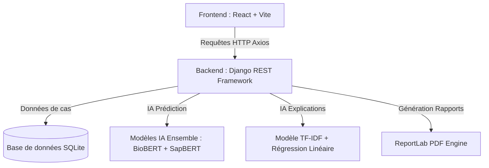

#  PhenoGenoAI — Plateforme d'Analyse Génomique Intelligente

Bienvenue dans le dépôt de **PhenoGenoAI** ! 

Ce projet est une application web full-stack innovante qui utilise l'Intelligence Artificielle (IA) pour faire le pont entre la médecine clinique et la génétique. Elle permet d'identifier des anomalies génétiques potentielles chez un patient à partir de la description simple de ses symptômes.

---

## Le Projet Expliqué Simplement 

###  Qu'est-ce que le Phénotype et le Génotype ?
Pour comprendre ce projet, imaginez le corps humain comme une maison :
*   **Le Génotype (la cause) :** C'est le **plan de construction** (l'ADN). Si le plan contient une erreur (une mutation génétique), la maison aura un défaut.
*   **Le Phénotype (la conséquence) :** Ce sont les **défauts visibles** de la maison (par exemple : une porte de travers, un mur fragile). En médecine, ce sont les **symptômes cliniques** observés chez le patient (ex. : crises d'épilepsie, retard de développement, tonus musculaire faible).

###  Quel est le rôle de PhenoGenoAI ?
Trouver quel gène précis est responsable d'une maladie en lisant l'ADN d'un patient, c'est comme chercher une aiguille dans une botte de foin géante. 
**PhenoGenoAI résout ce problème** : 
1. Le médecin saisit les symptômes du patient en texte libre (ex. : *"convulsions, tonus musculaire faible"*).
2. Notre **Intelligence Artificielle** analyse ce texte, repère les termes médicaux importants, et cherche dans sa base de connaissances scientifiques.
3. Elle prédit et classe instantanément les **3 gènes candidats** les plus susceptibles d'être à l'origine de ces symptômes, ainsi que les maladies associées, avec un score de probabilité.

---

##  Fonctionnalités Principales

###  1. Le Workbench (Espace de Travail)
*   **Saisie intuitive :** Écrivez les symptômes en langage médical ou courant.
*   **Surlignage IA (Explainable AI) :** L'application surligne automatiquement les mots du texte qui ont le plus influencé la décision de l'IA (grâce à une carte d'attention).
*   **Prédictions en temps réel :** Affichage des gènes candidats (ex: *SCN1A*, *MECP2*, *BRCA1*), de leur probabilité et de liens directs vers la base de données scientifique mondiale **OMIM**.

###  2. Simulateur de Signal Génomique (Live DNA Stream)
*   **Séquençage en direct :** Un module simule le travail d'une machine de séquençage d'ADN en temps réel, montrant les flux de lettres (`A`, `T`, `C`, `G`) défiler à l'écran, avec leur score de qualité et leur taux de couverture.
*   **Visualisation 3D :** Un magnifique modèle d'hélice d'ADN en 3D tourne en arrière-plan (réalisé en Three.js) pour une expérience utilisateur haut de gamme.

###  3. Gestion de Cohortes & Qualité
*   **Base de Données des Cas :** Enregistrement et suivi des dossiers de patients analysés.
*   **Contrôle Qualité automatique :** L'application vérifie si le dossier du patient contient toutes les informations requises (âge, sexe, symptômes complets) et affiche des alertes en cas de données manquantes.
*   **Score de Cohérence :** Un algorithme calcule un score de cohérence pour valider la pertinence des gènes identifiés par rapport aux symptômes renseignés.

###  4. Import & Export
*   **Import CSV :** Possibilité d'importer une liste entière de patients à partir d'un simple fichier CSV.
*   **Rapports PDF :** Génération instantanée d'un rapport de diagnostic propre au format PDF en un clic.

---

##  Architecture Technique

Le projet est divisé en deux parties principales (Full-stack) :



###  Frontend (L'Interface Utilisateur)
*   **Framework :** React avec Vite (rapide et moderne).
*   **Design & Animations :** TailwindCSS (design épuré et sombre type "cyber-médical") + Framer Motion (transitions ultra-fluides).
*   **Graphismes 3D :** Three.js avec `@react-three/fiber` et `@react-three/drei` pour l'ADN 3D.
*   **Langues :** Traduction complète en **Français** et **Anglais** (via `i18next`).

###  Backend (Le Cerveau)
*   **Framework :** Python avec Django et Django REST Framework (DRF) pour l'API.
*   **Base de données :** SQLite (léger, inclus par défaut, ne nécessite aucune configuration externe).
*   **Modèles d'IA logés dans le dossier `phenogeno_ensemble_deploy/` :**
    *   **Ensemble BioBERT + SapBERT (Poids 60/40) :** Deux modèles de Deep Learning spécialisés dans le biomédical pour classifier les textes de symptômes avec une précision maximale.
    *   **TF-IDF + Régression Linéaire (Scikit-Learn) :** Utilisé pour calculer l'importance de chaque mot (carte d'attention) afin d'expliquer visuellement les prédictions au médecin.

---

##  Structure du Projet

```text
PhenoGenoAI/
├── backend/                       # Serveur Django (Python)
│   ├── phenogenoai/               # Configuration globale de Django
│   ├── prediction/                # Logique de l'application (Vues, Modèles, API)
│   │   ├── ml_models.py           # Chargement et exécution des modèles IA
│   │   ├── metrics.py             # Mesure des performances de l'API (latence, requêtes)
│   │   └── views.py               # Points d'accès de l'API (Endpoints)
│   ├── db.sqlite3                 # Base de données locale
│   └── requirements.txt           # Dépendances Python à installer
├── frontend/                      # Interface utilisateur (React)
│   ├── src/
│   │   ├── components/            # Composants réutilisables (DNA3D, DNASignal, etc.)
│   │   ├── pages/                 # Différentes pages de l'application
│   │   ├── App.jsx                # Gestion du routage et des thèmes
│   │   └── main.jsx               # Point d'entrée React
│   ├── package.json               # Dépendances Node.js
│   └── tailwind.config.cjs        # Configuration des styles
└── phenogeno_ensemble_deploy/     # Fichiers de poids des modèles d'IA pré-entraînés
```

---

##  Guide de Démarrage Rapide

Suivez ces étapes simples pour lancer le projet sur votre machine.

### Prérequis
*   [Python 3.10 ou supérieur](https://www.python.org/downloads/)
*   [Node.js (version 18 ou supérieure)](https://nodejs.org/)

---

###  Étape 1 : Configurer et Lancer le Backend (Serveur Python)

1. Ouvrez votre terminal dans le dossier racine du projet `PhenoGenoAI`.
2. Créez un environnement virtuel Python pour isoler les dépendances :
   ```bash
   python -m venv venv
   ```
3. Activez l'environnement virtuel :
   *   **Sur Windows (PowerShell) :**
       ```powershell
       .\venv\Scripts\Activate.ps1
       ```
   *   **Sur macOS / Linux :**
       ```bash
       source venv/bin/activate
       ```
4. Installez les paquets requis :
   ```bash
   pip install -r backend/requirements.txt
   ```
5. Appliquez les migrations pour créer les tables de la base de données :
   ```bash
   python backend/manage.py migrate
   ```
6. Lancez le serveur de développement :
   ```bash
   python backend/manage.py runserver
   ```
   *Le serveur tourne maintenant sur : **`http://127.0.5.1:8000/`***

---

###  Étape 2 : Configurer et Lancer le Frontend (Interface React)

1. Ouvrez un **nouveau terminal** (tout en laissant tourner le serveur backend).
2. Déplacez-vous dans le dossier `frontend` :
   ```bash
   cd frontend
   ```
3. Installez toutes les bibliothèques Node.js nécessaires :
   ```bash
   npm install
   ```
4. Lancez le serveur de développement React (Vite) :
   ```bash
   npm run dev
   ```
   *L'application s'ouvre dans votre navigateur à l'adresse : **`http://localhost:5173/`*** 

---

##  Documentation des API Backend

Si vous souhaitez interagir directement avec l'API du serveur sans passer par l'interface web, voici les points d'accès disponibles :

| Méthode | Endpoint | Description | Paramètres (JSON) / Réponse |
| :--- | :--- | :--- | :--- |
| **POST** | `/api/predict/` | Prédit les gènes associés aux symptômes. | `{"symptoms_text": "convulsions, hypotonie"}` |
| **GET** | `/api/genomic-signal/` | Récupère le flux de séquençage d'ADN simulé. | *(Aucun)* |
| **GET** | `/api/analyses/` | Liste les 200 dernières analyses de patients. | *(Aucun)* |
| **POST** | `/api/analyses/` | Crée une nouvelle analyse clinique. | Fiche patient complète (sexe, âge, gènes, etc.) |
| **POST** | `/api/analyses/import/` | Importe des données de patients via texte CSV. | `{"csv_text": "case_id,sex,age..."}` |
| **POST** | `/api/export/` | Génère et renvoie un rapport PDF. | Contenu des résultats de prédiction. |
| **GET** | `/api/health/` | Télémétrie en direct (Uptime, latence en ms, etc.). | *(Aucun)* |

---

##  Contribuer au projet

1. **Forkez** le projet.
2. Créez votre branche de fonctionnalité (`git checkout -b feature/AmazingFeature`).
3. Validez vos modifications (`git commit -m 'Add some AmazingFeature'`).
4. Poussez la branche (`git push origin feature/AmazingFeature`).
5. Ouvrez une **Pull Request**.

---

